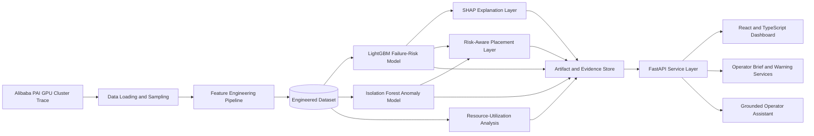

# ComputePulse: Predictive Cluster Intelligence

> From reactive monitoring to explainable, data-driven infrastructure decisions.

[](https://www.python.org/)
[](https://fastapi.tiangolo.com/)
[](https://lightgbm.readthedocs.io/)
[](https://react.dev/)
[](https://vite.dev/)
[](https://github.com/alibaba/clusterdata/tree/master/cluster-trace-gpu-v2020)

**Team:** Aletheia  
**Team members:** Fateha Hossain Anushka (Team Leader), Hanjala Habib Sadik

---

## Overview

ComputePulse is a full-stack cluster-intelligence prototype developed from the **Alibaba PAI GPU Cluster Trace**. It combines reproducible data preparation, machine-learning-based failure-risk estimation, anomaly detection, explainable predictions, risk-aware placement recommendations, resource-utilization analysis, REST APIs, and an interactive operations dashboard.

Conventional monitoring platforms are excellent at showing the current state of infrastructure. ComputePulse investigates the next engineering question:

> How can historical workload and resource telemetry support earlier, explainable, and more informed cluster-management decisions?

The project is designed as a decision-support and research prototype. It does not control a live production cluster, and its dashboard replays static historical trace data rather than claiming to receive live telemetry.

---

## Why ComputePulse Matters

Shared GPU infrastructure is expensive and operationally complex. Failures, resource contention, and underutilized capacity can interrupt experiments and reduce the effective value of computing resources. Cluster operators therefore need more than raw charts: they need evidence-based risk estimates, understandable explanations, and actionable recommendations.

ComputePulse brings these elements together in one system:

| Operational question | ComputePulse capability |
|---|---|
| Which observations appear most strongly associated with failure? | LightGBM failure-risk estimation |
| Is the current resource pattern unusual? | Isolation Forest anomaly detection |
| Why did the system assign a high risk score? | SHAP-based local and global explanations |
| Which machines should a scheduler prefer or avoid? | Risk-aware candidate ranking |
| Where might capacity be underutilized? | Utilization analysis with configurable cost assumptions |
| How can an operator explore the evidence? | FastAPI services and an interactive React dashboard |

---

## Key Features

- **Real trace-based pipeline:** Processes workload and sensor records from Alibaba's PAI GPU cluster trace.
- **Reproducible feature engineering:** Builds CPU, GPU, memory-pressure, resource-imbalance, I/O, duration, task-role, and machine-level features.
- **Failure-risk estimation:** Uses a tuned LightGBM classifier to estimate the probability associated with failed or interrupted workload observations.
- **Anomaly detection:** Uses Isolation Forest to identify unusual resource-utilization patterns.
- **Explainable AI:** Uses TreeSHAP to expose the contribution of individual features to model predictions.
- **Risk-aware placement:** Aggregates risk at machine level and ranks candidate machines for workload-placement decisions.
- **Resource optimization:** Identifies consistently underutilized machines and provides scenario-based idle-capacity estimates.
- **Operational API:** Exposes fleet, node, warning, explanation, placement, optimization, metrics, demonstration, briefing, and chat services through FastAPI.
- **Interactive frontend:** Provides fleet views, warnings, node inspection, placement comparison, optimization views, evidence pages, and a guided demonstration.
- **Deployment support:** Includes Vercel, Render, Docker, environment-template, and local-development configuration.

---

## System Architecture



### Architectural Layers

| Layer | Responsibility | Main technologies |
|---|---|---|
| Data layer | Load, sample, merge, clean, and transform trace records | Pandas, NumPy |
| Intelligence layer | Risk estimation, anomaly detection, feature attribution | LightGBM, scikit-learn, SHAP |
| Decision layer | Candidate ranking, warning logic, and utilization analysis | Python, Pandas |
| Service layer | Serve model artifacts and operational views | FastAPI, Pydantic |
| Presentation layer | Visualize fleet state, evidence, risks, and recommendations | React, TypeScript, Vite, Recharts, Three.js |
| Deployment layer | Configure local and hosted execution | Docker, Render, Vercel |

The detailed architecture is also available in [`docs/SYSTEM_ARCHITECTURE.md`](docs/SYSTEM_ARCHITECTURE.md).

---

## Data Source and Processing

ComputePulse uses the public **Alibaba Cluster Trace Program GPU trace (v2020)**, which represents production activity from Alibaba's PAI platform.

- **Official source:** [Alibaba Cluster Trace GPU v2020](https://github.com/alibaba/clusterdata/tree/master/cluster-trace-gpu-v2020)
- **Download mirror:** [Split GPU trace files](https://github.com/qzweng/clusterdata-cluster-trace-gpu-v2020-data)
- **Primary input tables:** `pai_instance_table.csv` and `pai_sensor_table.csv`
- **Processed dataset:** `backend/data/cluster_data_real.csv`

The preprocessing pipeline:

1. Loads instance status, machine identity, and timing information.
2. Samples sensor records in chunks to remain practical on ordinary development hardware.
3. Joins instance and sensor records using workload identifiers.
4. converts raw values to numeric representations and handles invalid values.
5. Engineers model-ready resource and workload features.
6. Creates the current binary target from recorded `failed` and `interrupted` statuses.
7. Saves the reproducible processed dataset for model training and evaluation.

### Primary Model Features

| Feature | Meaning |
|---|---|
| `task_role` | Encoded workload/task role |
| `cpu_usage_pct` | Observed CPU utilization |
| `gpu_usage_pct` | Observed GPU worker utilization |
| `mem_pressure` | Average memory relative to recorded peak memory |
| `gpu_mem_pressure` | Average GPU memory relative to recorded peak GPU memory |
| `cpu_gpu_ratio` | Capped CPU-to-GPU utilization ratio |
| `io_bytes_total` | Combined read and write volume |
| `io_ops_total` | Combined read and write operations |
| `avg_io_size` | Estimated average bytes per I/O operation |

> **Target definition:** The current primary classifier estimates whether an observation is associated with a workload whose recorded final status is failed or interrupted. It should not be interpreted as a validated two-hour-ahead failure forecast.

---

## Machine-Learning Pipeline

### 1. Failure-Risk Model

The primary model is a tuned `LGBMClassifier`. The training workflow includes:

- stratified training and test partitions;
- five-fold stratified cross-validation on a representative training subset;
- randomized hyperparameter search;
- final training on the complete training partition;
- classification and ranking metrics;
- confusion-matrix reporting; and
- global SHAP feature-importance analysis.

### 2. Anomaly Model

An Isolation Forest pipeline identifies uncommon combinations of utilization features. Its output complements the supervised failure-risk score instead of replacing it.

### 3. Experimental Horizon Model

The repository contains an experimental next-observation risk regressor. This component estimates the next model-derived risk score within machine-grouped records. It is retained as exploratory work and is **not** presented as validated clock-time forecasting.

### 4. Explainability

TreeSHAP is used to expose how individual features influence a prediction. Explanations are surfaced through the backend and converted into operator-oriented summaries in the interface.

---

## Evaluation Snapshot

The committed evaluation report contains **100,014 processed observations**, with **20,003 observations** in the stratified test partition.

### Primary Model Results

| Metric | Reported value |
|---|---:|
| Accuracy | 0.881 |
| Precision | 0.774 |
| Recall | 0.718 |
| F1-score | 0.745 |
| ROC-AUC | 0.926 |
| PR-AUC | 0.831 |
| Brier score | 0.087 |
| Expected calibration error | 0.021 |

These values are read from the committed evaluation artifacts in `backend/results/`. They describe the repository's current **stratified row-level holdout**, using `random_state=42`.

### Interpretation Boundary

The current results demonstrate performance on held-out observations under the implemented split. Related observations from the same workload or machine may occur across partitions; therefore, these figures must not be interpreted as proof of generalization to entirely unseen machines, unseen workloads, or future time periods.

Group-based and temporal validation are important planned extensions.

### Placement-Policy Evidence

The committed placement evaluation reports the following observed failure-rate comparison for its candidate-selection experiment:

| Candidate-selection policy | Observed failure rate |
|---|---:|
| Random selection | 0.2183 |
| Risk-only policy | 0.1581 |
| Risk-and-anomaly policy | 0.1292 |

The fused policy produced an **18.27% relative reduction** compared with the risk-only policy and a **40.82% relative reduction** compared with random selection in the recorded experiment. These are offline experimental results, not production-SLA guarantees.

### Reproducing the Evaluation

```bash
cd backend
python scripts/run_eval_suite.py
```

Additional evidence is available in:

- `backend/results/eval_report.json`
- `backend/results/model_results.txt`
- `backend/results/cv_results.txt`
- `backend/results/classification_report.txt`
- `backend/results/confusion_matrix.txt`
- `backend/results/feature_importance.txt`
- `backend/results/placement_lift.json`
- `backend/results/optimization_opportunities.csv`

---

## Decision-Support Modules

### Risk-Aware Placement

The placement component is a decision layer rather than a separately supervised “optimal placement” classifier. The public trace does not provide ground-truth labels describing the optimal destination for every incoming job.

ComputePulse therefore:

1. scores observations using the trained risk model;
2. aggregates historical scores at machine level;
3. incorporates anomaly evidence where configured;
4. ranks healthier and riskier candidate machines; and
5. exposes recommendations with limitations rather than claiming guaranteed optimality.

### Resource-Utilization Analysis

The optimization component identifies machines whose average recorded GPU utilization falls below a configurable threshold. It also provides scenario-based cost estimates using a documented cost-per-GPU-hour assumption.

These figures are exploratory decision-support estimates. The Alibaba trace does not contain public-cloud prices, and repeated sensor observations can affect duration-based aggregation. They should not be interpreted as audited financial savings.

---

## Backend API

The FastAPI application organizes its functionality into dedicated routers.

| Capability | Purpose |
|---|---|
| Health | Report artifact and API readiness |
| Fleet | Return fleet-level operational summaries |
| Nodes | Inspect individual node evidence |
| Placement | Compare and rank candidate machines |
| Optimize | Explore utilization opportunities |
| Metrics | Retrieve evaluation evidence |
| Explain | Generate feature-based model explanations |
| Warnings | Scan for actionable risk conditions |
| Brief | Produce an operator-oriented daily action brief |
| Chat | Answer supported operational questions using grounded project context |
| Demo | Support reproducible demonstration scenarios |

After starting the backend, interactive API documentation is available at:

```text
http://localhost:8000/docs
```

---

## Dashboard

The React application presents the system as an operator-facing cluster-intelligence workspace.

| View | Purpose |
|---|---|
| Fleet | Summarize overall cluster health and risk distribution |
| Cluster Map | Explore machines spatially through an interactive visualization |
| Warnings | Review prioritized operational alerts |
| Node Explorer | Inspect node-level utilization, risk, and explanations |
| Placement | Compare candidate destinations for incoming workloads |
| Optimize | Review underutilized capacity and scenario assumptions |
| Compare | Compare risk and operational indicators across machines |
| Evidence | Inspect evaluation metrics and methodological context |
| Run Demo | Replay a guided operational scenario |
| Daily Brief | Convert technical signals into prioritized operator actions |

The dashboard uses React, TypeScript, Vite, Recharts, Framer Motion, and Three.js. Visual refreshes are simulations or historical replays unless a page explicitly identifies another data mode.

---

## Repository Structure

```text
computepulse/
|-- backend/
|   |-- api/
|   |   |-- routers/              # FastAPI route modules
|   |   `-- services/             # Storage, explanations, chat, and warning logic
|   |-- data/                     # Processed data and local raw-data location
|   |-- models/                   # Serialized ML artifacts
|   |-- results/                  # Evaluation and decision-support evidence
|   |-- scripts/                  # Evaluation and analysis utilities
|   |-- prepare_dataset.py        # Trace loading and feature engineering
|   |-- baseline_model.py         # Rule-based comparison
|   |-- train_model.py            # Primary LightGBM workflow
|   |-- train_anomaly.py          # Isolation Forest workflow
|   |-- train_horizon.py          # Exploratory next-observation model
|   |-- model2_placement.py       # Machine-level placement ranking
|   `-- model3_optimization.py    # Utilization analysis
|-- Frontend/
|   |-- src/
|   |   |-- api/                  # Backend client
|   |   |-- components/           # Shared interface components
|   |   |-- context/              # Application state
|   |   `-- pages/                # Dashboard views
|   `-- public/
|-- docs/                         # Architecture and design documentation
|-- Dockerfile
|-- Makefile
|-- render.yaml
`-- requirements.txt
```

---

## Local Setup

### Prerequisites

- Python 3.10 or newer
- Node.js 18 or newer
- npm
- Git

### 1. Clone the Repository

```bash
git clone https://github.com/anushka06onu/computepulse.git
cd computepulse
```

### 2. Configure the Backend

```bash
cd backend
python -m venv .venv
```

Activate the virtual environment:

```bash
# Linux or macOS
source .venv/bin/activate

# Windows PowerShell
.venv\Scripts\Activate.ps1
```

Install dependencies:

```bash
pip install -r requirements.txt
```

Copy the environment template and add only the optional services you intend to use:

```bash
cp .env.example .env
```

Start the API:

```bash
uvicorn api.main:app --reload --port 8000
```

### 3. Configure the Frontend

In another terminal:

```bash
cd Frontend
npm install
cp .env.example .env
npm run dev
```

Open:

```text
http://localhost:5173
```

---

## Rebuilding the Data and Models

The processed sample and trained artifacts are included for reproducible demonstration. To rebuild them from the source trace:

1. Download and extract:
   - `pai_instance_table.csv`
   - `pai_sensor_table.csv`
2. Place both files in `backend/data/`.
3. Run the pipeline from the backend directory:

```bash
cd backend
python prepare_dataset.py
python baseline_model.py
python train_model.py
python train_anomaly.py
python train_horizon.py
python model2_placement.py
python model3_optimization.py
python scripts/run_eval_suite.py
```

Large raw trace files should remain excluded from version control.

---

## Responsible Interpretation and Limitations

ComputePulse is an academic and engineering prototype. Its outputs should be interpreted within the following boundaries:

- The source is a static historical trace, not a live production feed.
- The primary target represents association with recorded failed/interrupted workload status; it is not yet a validated two-hour-ahead target.
- Current headline metrics use a stratified row-level holdout, not a machine-grouped or chronological test.
- Placement recommendations are offline decision-support rankings because the dataset has no “optimal placement” ground truth.
- Cost estimates use configurable assumptions and are not audited savings.
- The project does not automatically migrate real workloads or modify a production cluster.
- The operator assistant is restricted to supported project evidence and should not be treated as an autonomous infrastructure controller.

These limitations are stated deliberately: trustworthy intelligent systems require transparent assumptions as well as strong performance.

---

## Planned Improvements

- [ ] Retain workload and timestamp identifiers required for grouped and chronological evaluation.
- [ ] Evaluate generalization on unseen workers, jobs, and machines.
- [ ] Construct an observed, timestamp-based prediction horizon.
- [ ] Add Logistic Regression, Random Forest, and additional boosting baselines.
- [ ] Deduplicate workload duration before GPU-hour aggregation.
- [ ] Evaluate placement through chronological trace replay.
- [ ] Add automated data-schema and model-regression tests.
- [ ] Introduce artifact versioning and experiment tracking.
- [ ] Validate the system against streaming telemetry in a controlled cluster environment.

---

## What This Project Demonstrates

ComputePulse demonstrates an end-to-end approach to engineering a data-intensive intelligent software system:

- processing real large-scale infrastructure data;
- designing and evaluating predictive models;
- integrating explainability into operational decisions;
- turning model artifacts into backend services;
- translating technical evidence into an accessible user interface;
- documenting assumptions, limitations, and reproducibility; and
- connecting data engineering, machine learning, software architecture, and human-centered decision support.

---

## Team and Contributions

ComputePulse was developed by **Team Aletheia** for an AI hackathon.

| Team member | Role |
|---|---|
| Fateha Hossain Anushka | Team Leader |
| Hanjala Habib Sadik | Team Member |

For academic or portfolio use, each contributor should separately describe their verified individual responsibilities, such as data engineering, model development, backend implementation, frontend development, evaluation, documentation, deployment, or team coordination.

---

## Acknowledgements

- [Alibaba Cluster Trace Program](https://github.com/alibaba/clusterdata) for publishing the GPU cluster trace.
- The maintainers of LightGBM, scikit-learn, SHAP, FastAPI, React, and the other open-source libraries used in this project.

---

## Contact

For questions, reproducibility notes, or collaboration inquiries, open an issue in this repository.
