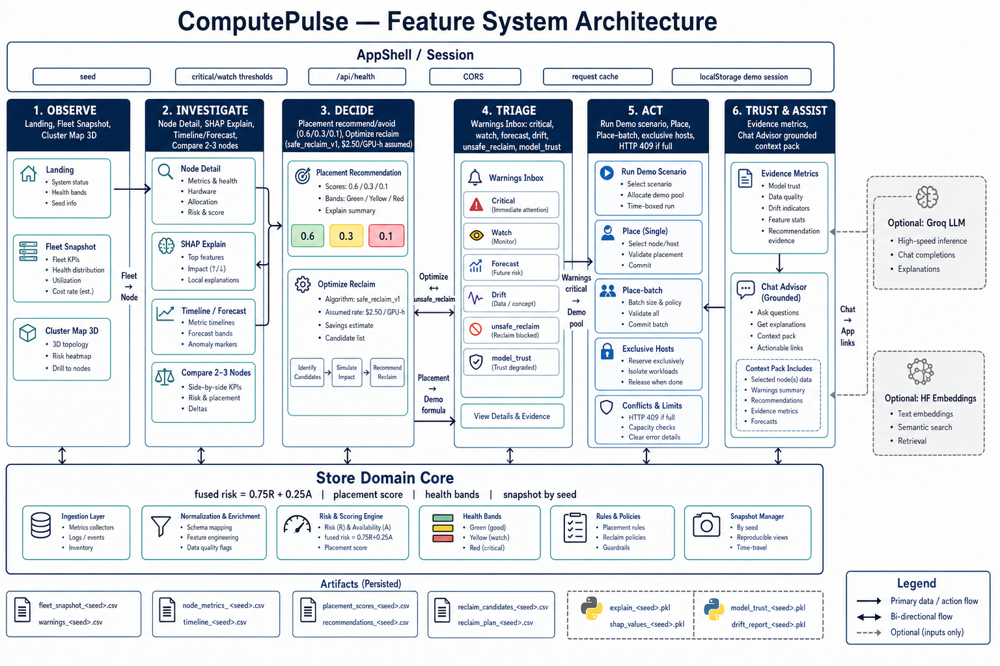
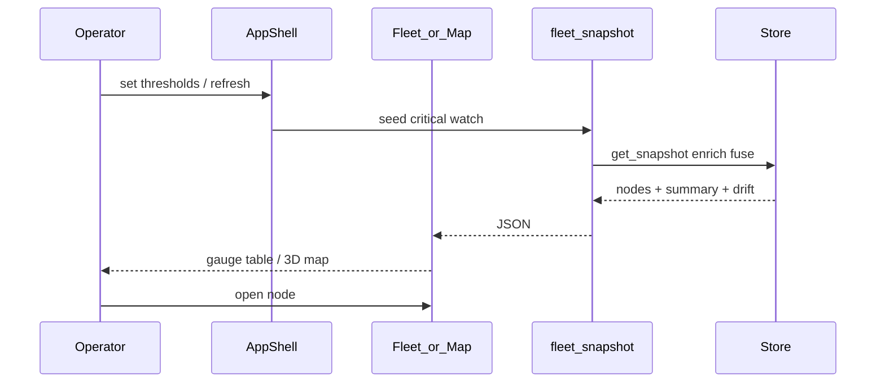
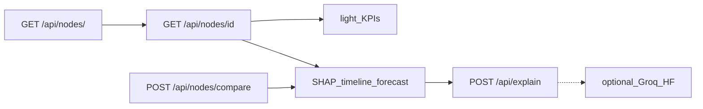
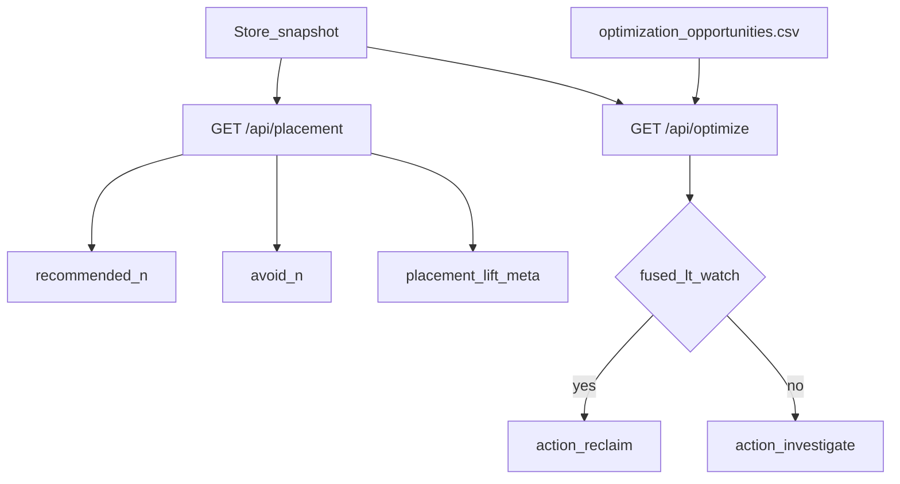
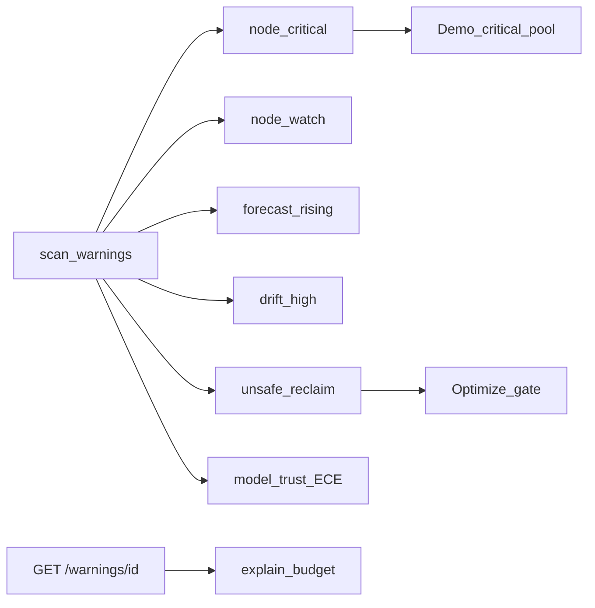
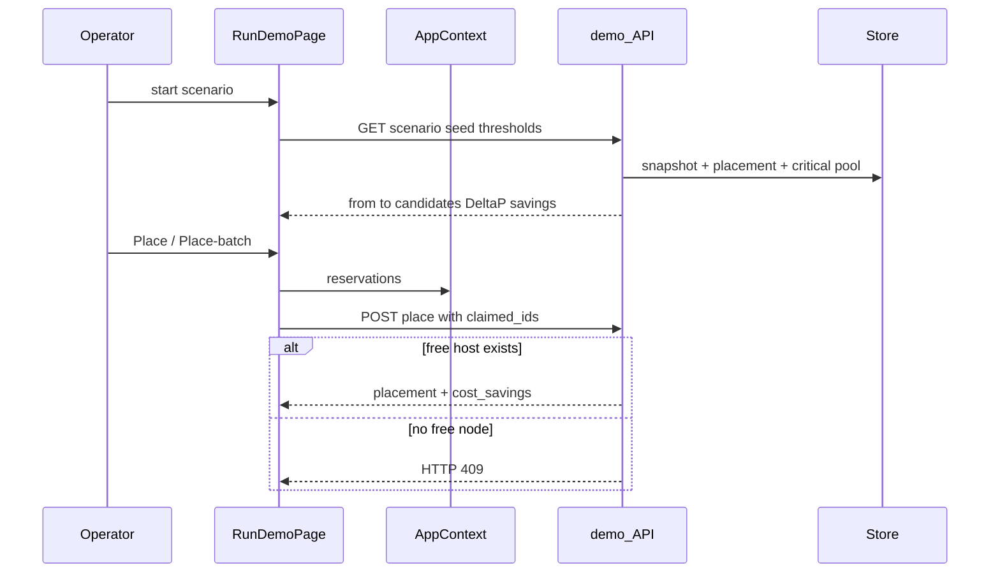
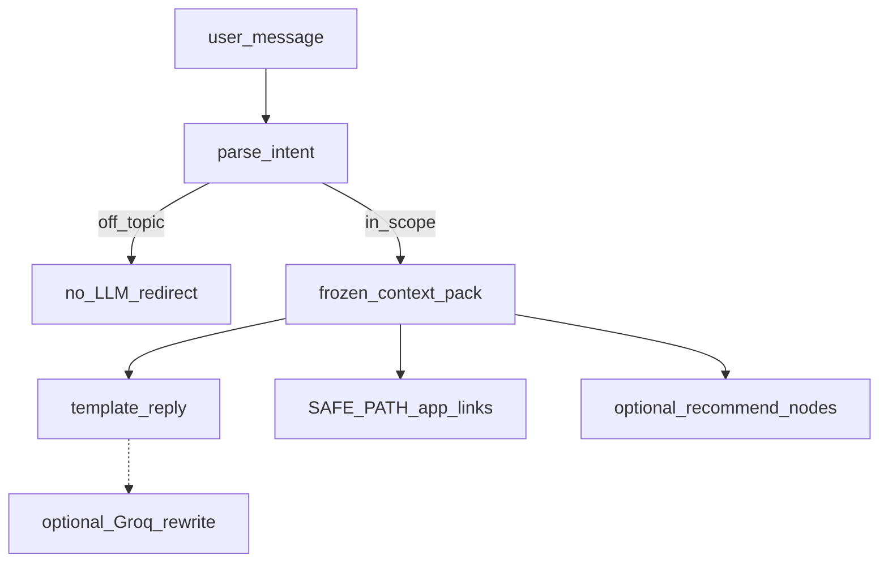

# ComputePulse — System Architecture

## 1. What this system is

ComputePulse is a **decision-support platform** for GPU fleet risk and placement. Operators observe fused failure risk across the cluster, investigate nodes with SHAP explanations, place jobs on safer hosts, reclaim underutilized capacity under a risk gate, triage warnings, run an exclusive placement demo, and ask a grounded advisor — all over one shared scoring core.

**Not in this diagram:** offline ML training pipelines. At runtime the system loads pre-built artifacts once and serves feature workflows.

---

## 2. Layered system view

```mermaid
flowchart TB
  subgraph presentation [Presentation_Layer]
    Landing[Landing_/]
    Shell[AppShell_/app]
    Pages[Feature_Pages]
    ChatUI[ChatDock_overlay]
    Landing --> Shell --> Pages
    Shell --> ChatUI
  end

  subgraph session [Session_Layer]
    Ctx[AppContext]
    Seed[seed]
    Thr[critical_watch]
    DemoSess[demo_reservations_localStorage]
    Cache[api_client_TTL_cache]
    Ctx --> Seed
    Ctx --> Thr
    Ctx --> DemoSess
    Ctx --> Cache
  end

  subgraph api [API_Layer_FastAPI]
    Health["/api/health"]
    FleetAPI["/api/fleet"]
    NodesAPI["/api/nodes"]
    PlaceAPI["/api/placement"]
    OptAPI["/api/optimize"]
    MetricsAPI["/api/metrics"]
    WarnAPI["/api/warnings"]
    DemoAPI["/api/demo"]
    ExplainAPI["/api/explain"]
    ChatAPI["/api/chat"]
  end

  subgraph services [Service_Layer]
    Store[Store_snapshot_fuse_SHAP]
    WarnSvc[warnings_scan]
    ExplainSvc[explain_node]
    ChatSvc[chat_grounded]
    Catalog[chat_catalog]
  end

  subgraph domain [Domain_Core]
    Fuse["fused = 0.75R + 0.25A"]
    PlaceScore["placement 0.6/0.3/0.1"]
    Bands[critical_watch_bands]
    ReclaimGate[safe_reclaim_v1]
  end

  subgraph artifacts [Artifact_Store_disk]
    CSV[cluster_data_real.csv]
    PKL[risk_anomaly_horizon_pkl]
    Results[node_scores_optimize_eval_lift]
  end

  subgraph external [Optional_External]
    Groq[Groq_LLM]
    HF[HF_embeddings]
  end

  Shell --> Ctx
  Pages --> FleetAPI & NodesAPI & PlaceAPI & OptAPI & MetricsAPI & WarnAPI & DemoAPI & ExplainAPI
  ChatUI --> ChatAPI
  FleetAPI & NodesAPI & PlaceAPI & OptAPI & WarnAPI & DemoAPI & ExplainAPI & ChatAPI --> Store
  Store --> Fuse & PlaceScore & Bands
  OptAPI --> ReclaimGate
  WarnSvc --> Store
  ExplainSvc --> Store
  ChatSvc --> Store & Catalog
  ExplainSvc -.-> Groq & HF
  ChatSvc -.-> Groq & HF
  Store --> CSV & PKL & Results
```

---

## 3. Cross-cutting controls

| Control | Owner | Effect on features |
|---------|--------|-------------------|
| **seed** | AppContext + `POST /api/fleet/refresh` | Deterministic 1-row-per-node snapshot; refresh bumps seed and clears demo session |
| **critical / watch** | AppContext (default 70 / 40) | Health bands on Fleet/Map/Node; Demo avoid pool; Warnings; Optimize reclaim gate (watch) |
| **CORS** | `main.py` | Localhost Vite + `FRONTEND_ORIGINS`; optional `CORS_ALLOW_ALL` |
| **Readiness** | `GET /api/health` | Pages gate until required artifacts exist |
| **Request cache** | `client.ts` | ~12s GET TTL; cleared on refresh / threshold commit |
| **Shadow log** | `results/shadow_log.jsonl` | placement, demo, warnings, chat events |

**Shared formulas**

- **Fused risk:** `0.75 · risk_score + 0.25 · anomaly_score · 100`
- **Fleet health:** `100 − mean(fused_risk)`
- **Placement score:** `0.6 · safety + 0.3 · normality + 0.1 · history`
- **Reclaim:** underutilized **and** `fused < watch` → `reclaim`, else `investigate`

---

## 4. Feature workflows (end-to-end)

### 4.1 Observe — Fleet & Cluster Map

| | |
|--|--|
| **Routes** | `/app/fleet`, `/app/map` |
| **API** | `GET /api/fleet/snapshot`, `POST /api/fleet/refresh` |
| **Outputs** | Health grade, critical/watch/healthy counts, ranked nodes, PSI-approx drift |
| **Next** | Node Explorer, Warnings strip |

### 4.2 Investigate — Node, Explain, Compare

| | |
|--|--|
| **Routes** | `/app/nodes`, `/app/nodes/:id`, `/app/compare` |
| **API** | nodes list/detail, compare, explain |
| **Outputs** | Fused scores, SHAP reasons, timeline + horizon forecast, narrative brief |
| **Hub for** | Fleet, Map, Placement, Optimize, Warnings, Demo, Chat |

### 4.3 Decide — Placement & Optimize

| Feature | Route | Policy | Notes |
|---------|-------|--------|-------|
| Placement | `/app/placement` | `risk_anomaly_v2` | Live score + correlation/lift artifacts |
| Optimize | `/app/optimize` | `safe_reclaim_v1` | Idle hours × **assumed $2.50/GPU-h** (not invoices) |

### 4.4 Triage — Warnings Inbox

| | |
|--|--|
| **Route** | `/app/warnings` (+ shell badge counts) |
| **API** | counts, list, run, alert detail |
| **Shared with Demo** | critical-ranked nodes become the unsafe “from” pool |

### 4.5 Act — Run Demo (exclusive placement)

| | |
|--|--|
| **Route** | `/app/demo` |
| **Rules** | One job per node per session (server + client) |
| **Savings** | `ΔP(fail) × (24h × $2.50 + $850)` — demo assumptions |
| **Cleared when** | Fleet refresh / new seed |

### 4.6 Trust — Evidence

| | |
|--|--|
| **Route** | `/app/evidence` |
| **API** | `GET /api/metrics` (holdout artifacts; seed-independent) |
| **Outputs** | Accuracy, ROC-AUC, PR-AUC, Brier, ECE, top-k recall, confusion, feature importance, placement lift, provenance |
| **Feeds** | Warnings `model_trust` if ECE high; Chat playbooks |

### 4.7 Assist — Chat Advisor

| | |
|--|--|
| **UI** | `ChatDock` overlay in AppShell |
| **API** | `POST /api/chat` (history ≤10, message ≤4000) |
| **Grounding** | Store snapshot + explain/SHAP + placement shortlist + `chat_catalog` only |
| **Security** | HTML escape + in-app path allowlist |

### 4.8 Entry — Landing

| | |
|--|--|
| **Route** | `/` |
| **API** | None (static marketing + CTAs) |
| **Exits to** | `/app/fleet`, `/app/demo`, `/app/evidence` |

---

## 5. Feature ↔ domain dependency matrix

| Feature | Snapshot | Fuse | SHAP | Horizon | Placement score | Optimize CSV | Eval/lift | LLM |
|---------|:--------:|:----:|:----:|:-------:|:---------------:|:------------:|:---------:|:---:|
| Landing | | | | | | | | |
| Fleet / Map | ✓ | ✓ | | | | | drift | |
| Node | ✓ | ✓ | ✓ | ✓ | | | | explain |
| Compare | ✓ | ✓ | ✓ | ✓ | | | | |
| Placement | ✓ | ✓ | | | ✓ | | lift | |
| Optimize | ✓ | ✓ | | | | ✓ | | |
| Evidence | | meta | | | | | ✓ | |
| Warnings | ✓ | ✓ | budget | opt | ✓ | gate | ECE | detail |
| Demo | ✓ | ✓ | reasons | | ✓ + exclusivity | | | |
| Chat | ✓ | ✓ | cached | | recommend | | | optional |
| Shell | health | | | | | | | |

---

## 6. Component map (key paths)

| Layer | Paths |
|-------|--------|
| Shell / session | `Frontend/src/App.tsx`, `AppShell.tsx`, `context/AppContext.tsx`, `api/client.ts` |
| Pages | `Frontend/src/pages/{Landing,Fleet,ClusterMap,Node,Compare,Placement,Optimize,Evidence,Warnings,RunDemo}Page.tsx` |
| Chat UI | `Frontend/src/components/ChatDock.tsx` |
| API entry | `backend/api/main.py` |
| Routers | `backend/api/routers/{fleet,nodes,placement,optimize,metrics,demo,explain,warnings,chat}.py` |
| Services | `backend/api/services/{store,explain,warnings,chat,chat_catalog}.py` |
| Artifacts | `backend/data/cluster_data_real.csv`, `backend/models/*.pkl`, `backend/results/*` |

---

## 7. Honesty constraints (architecture-level)

- Fleet views are a **seeded historical replay** of the Alibaba research trace — not a live production feed.
- Optimize and Demo **dollar figures** use documented assumed rates, not cloud invoices.
- Chat/Explain LLMs are **optional enrichment**; core scoring and placement work from local artifacts alone.
- Chat is **advisory** (grounded context pack), not a remediation / kubectl control plane.

---

## 8. How to read the architecture image

The PNG at the top is a **feature-centric system architecture**:

1. **Top** — AppShell session controls (seed, thresholds, health, CORS)
2. **Middle swimlanes** — Observe → Investigate → Decide → Triage → Act → Trust/Assist
3. **Bottom backbone** — Store domain core (fuse, placement score, bands, reclaim gate) over disk artifacts
4. **Side** — optional Groq / HF dashed into Chat & Explain only
